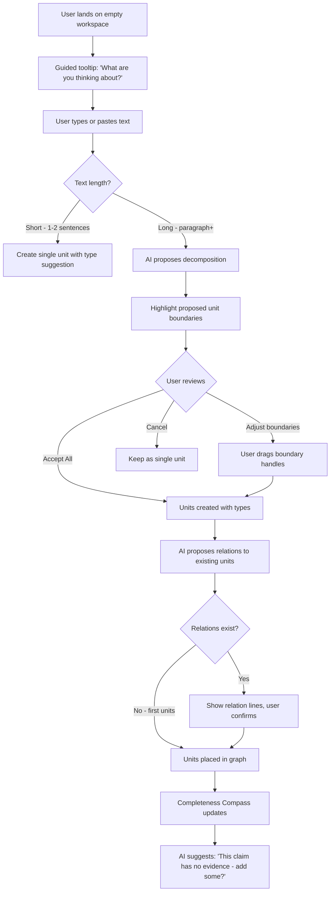
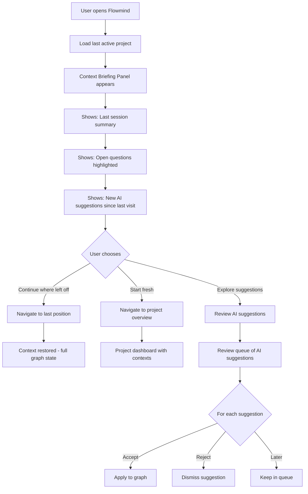
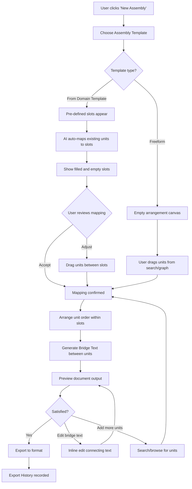
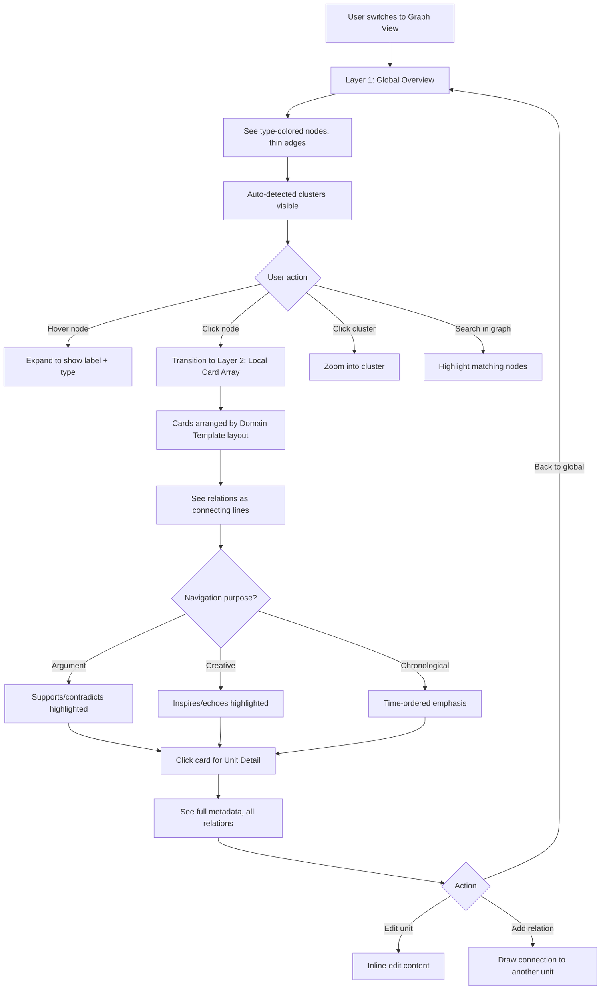

# UX Design Specification — Flowmind

**Author:** Eric
**Date:** 2026-03-17

---

## Executive Summary

### Project Vision

Flowmind is a thought-unit-centric personal knowledge management application that replaces the document-first paradigm with a thought-first paradigm. Rather than forcing users to decide "where do I save this thought?", Flowmind captures each fragment of thinking as an atomic **Thought Unit** — independently existing, carrying a logical role (claim, question, evidence, idea, etc.), and connected to other thoughts through a rich directed graph of typed relations.

The core promise is fourfold:
- **Re-entry**: Return to the exact cognitive state you were in before — context is preserved, not reconstructed
- **Non-loss**: No thought is discarded by structure; all fragments are preserved regardless of what compositions are made
- **Multi-purpose Composition**: The same thought is reused infinitely for different purposes via reference, not copy
- **Amplification**: AI elevates the user's cognitive capacity — refining expression, detecting gaps, suggesting connections — without replacing their thinking

### Target Users

**Primary persona: The Deep Thinker**
- Writers, researchers, academics, entrepreneurs, and intellectuals engaged in long-form thinking
- Working on problems that "don't yield immediate answers" — essay writing, research, complex decision-making, startup validation, philosophical inquiry
- Frustrated by document-centric tools that force linear structure on non-linear thinking
- Tech-savvy enough to adopt a new paradigm, but not necessarily developers
- Primarily desktop users (laptop/desktop), with future mobile access secondary

**Key user behaviors:**
- Capture thoughts in bursts, organize later (Capture Mode vs. Organize Mode)
- Need to revisit and build upon previous thinking across days, weeks, months
- Work across multiple intellectual projects simultaneously
- Value provenance — knowing where a thought came from and why it matters
- Want AI assistance that amplifies rather than replaces their own cognition

### Key Design Challenges

1. **Paradigm education**: Users are deeply habituated to document-first workflows. The thought-unit paradigm is genuinely novel and requires careful onboarding that doesn't overwhelm while demonstrating immediate value.

2. **Complexity management through progressive disclosure**: The system has enormous depth (30+ metadata fields per unit, 20+ relation types, multiple view types, Perspective Layer, Domain Templates). The UX must feel simple on the surface while making power accessible on demand.

3. **Graph navigation that feels natural**: Unlike file trees or linear documents, users navigate a directed graph. The transition between global overview (dot-and-line graph), local exploration (card arrays), and linear reading (thread view) must feel spatial and intuitive, not disorienting.

4. **AI trust calibration**: AI proposes unit boundaries, types, relations, and amplifications. The 3-stage lifecycle (Draft → Pending → Confirmed) must be visually clear without adding friction. Users need to feel in control while benefiting from AI assistance.

5. **Cross-view coordination**: Selecting a unit in Graph View must synchronize with Thread View, Assembly View, and Context Dashboard. This interconnection must feel seamless, not jarring.

### Design Opportunities

1. **"Aha moment" through decomposition**: The first time a user pastes a paragraph and sees it decomposed into typed, connected thought units, the paradigm shift becomes visceral. This is the key activation moment to design around.

2. **Graph as thinking mirror**: The Graph View can become a genuinely novel way to see one's own thinking — revealing clusters, gaps, contradictions, and orphan thoughts. No competitor offers this at the thought-unit level.

3. **Completeness Compass as gentle guide**: Rather than a blank page or a rigid wizard, the Compass tells users "here's what you have, here's what's missing, here's what you can produce now." This is a powerful, non-intrusive way to guide complex workflows.

4. **Assembly as cognitive superpower**: Dragging thought units into different arrangements to produce essays, pitches, specs — seeing the same thoughts serve multiple purposes — is a differentiating experience that should feel effortless and even delightful.

5. **Apple-caliber design as trust signal**: For a tool asking users to rethink their entire knowledge workflow, visual polish and interaction quality are not optional — they are trust signals that the product is worth the cognitive investment of learning.

## Core User Experience

### Defining Experience

The core user action in Flowmind is **capturing a thought and watching it become connected**. This is the atomic interaction that everything else builds upon. A user types or pastes text, and the system decomposes it into meaningful thought units, proposes types and relations, and places them within the living graph of their thinking. This moment — raw text becoming structured, connected knowledge — is the beating heart of the product.

The primary interaction loop is:
1. **Capture** — Type freely or paste text (zero friction, no decisions required)
2. **Decompose** — AI proposes unit boundaries and types (user approves/adjusts)
3. **Connect** — AI proposes relations to existing units (user confirms/modifies)
4. **Explore** — Navigate the growing graph to discover patterns, gaps, and insights
5. **Compose** — Assemble units into outputs (essays, specs, pitches) by reference

The secondary loop is **Re-entry**: returning to a previous Context and receiving an AI briefing of "here's where you left off, here's what's still open" — eliminating the reconstruction cost that plagues every other thinking tool.

### Platform Strategy

- **Primary platform**: Web application (desktop browsers, responsive)
- **Input method**: Keyboard-first with mouse/trackpad for graph manipulation and card arrangement
- **Keyboard shortcuts**: Essential for power users — Linear.app-style command palette for all actions
- **Offline**: Not required for MVP; all data persists server-side with optimistic UI updates
- **Future expansion**: Mobile-responsive for reading/quick capture; native apps for offline and push notifications
- **Target browsers**: Modern evergreen browsers (Chrome, Safari, Firefox, Edge)

### Effortless Interactions

These interactions must feel completely natural with zero cognitive overhead:

1. **Thought capture**: Typing into the input area should feel as frictionless as writing in Apple Notes. No modals, no decisions about "where" — just type.
2. **Unit approval**: When AI proposes decomposition, accepting/adjusting should be a single click or keyboard shortcut per unit. The default should almost always be right.
3. **View switching**: Moving between Graph View, Thread View, and Assembly View should feel like rotating a physical object — same data, different angle, smooth transition.
4. **Context switching**: Navigating between projects and contexts should preserve spatial memory (where you were, what was selected).
5. **Search**: Natural language queries ("things I claimed about market size") should just work, returning semantically relevant results instantly.

### Critical Success Moments

1. **First decomposition** (activation moment): When a user pastes their first paragraph and sees it split into typed, connected thought units — this must produce a genuine "aha, this is different" response. If this moment falls flat, the user never returns.

2. **First re-entry** (retention moment): When a user returns to a Context after days away and receives a contextual briefing with open questions highlighted — this demonstrates the core value of preserved cognitive state.

3. **First Assembly** (power moment): When a user drags units into an Assembly and generates a draft document — seeing their scattered thoughts become a coherent output — this is when the tool becomes indispensable.

4. **First Compass check** (guidance moment): When the Completeness Compass shows what's been covered and what's missing, the user sees their thinking mapped as a landscape rather than a list.

5. **First cross-context discovery** (serendipity moment): When a thought from one project is suggested as relevant to another — the system reveals a connection the user hadn't consciously made.

### Experience Principles

1. **Capture first, organize later**: Never interrupt the flow of thinking with organizational decisions. The system absorbs raw thought and proposes structure after the fact. Capture Mode is sacred.

2. **Show the shape of thinking**: The Graph View, Completeness Compass, and Context Dashboard should make the invisible structure of thought visible — not as an abstract visualization, but as an actionable map.

3. **AI proposes, human disposes**: Every AI action is a suggestion with a clear accept/modify/reject affordance. The Draft → Pending → Confirmed lifecycle is the core trust mechanism. The user's intellectual authority is never undermined.

4. **Same data, many lenses**: Units don't move between views — views are lenses on the same graph. Switching views should feel like changing perspective on a familiar object, not navigating to a new place.

5. **Progressive revelation, not progressive complexity**: New users see a clean capture interface. Power reveals itself through use — command palette, keyboard shortcuts, advanced metadata, custom relation types — each layer accessible but never imposed.

## Desired Emotional Response

### Primary Emotional Goals

1. **Intellectual empowerment**: Users should feel their thinking capacity is genuinely amplified — not that a machine is thinking for them, but that they can think more clearly, more deeply, and more connectedly than before. The feeling of "I can see my own thinking" is the north-star emotion.

2. **Calm confidence**: The interface should radiate quiet competence. Users should never feel overwhelmed by complexity or anxious about losing something. Every interaction should communicate "your thoughts are safe, organized, and accessible."

3. **Creative momentum**: When capturing thoughts, users should feel a flow state — the tool disappears, and only the thinking remains. When exploring the graph, they should feel the excitement of discovery — "I didn't realize these ideas were connected."

4. **Intellectual ownership**: Despite AI assistance, users should always feel "these are MY thoughts, MY connections, MY arguments." The AI is a lens, not an author. This emotional boundary is critical to product identity.

### Emotional Journey Mapping

| Stage | Desired Emotion | Design Implication |
|-------|----------------|-------------------|
| **Discovery/Landing** | Intrigued curiosity — "This is different from anything I've seen" | Clean, premium design with a compelling demo of decomposition |
| **Onboarding** | Gentle confidence — "I can do this, and it's worth learning" | Guided first experience with immediate payoff (first decomposition) |
| **First capture** | Flow and freedom — "I can just think, no friction" | Minimal UI, no organizational decisions, just a text field |
| **First decomposition** | Aha moment — "It understood my thinking!" | Elegant animation of text splitting into typed, connected units |
| **Daily use** | Productive calm — "Everything is where it should be" | Consistent, predictable patterns; excellent search; Context briefings |
| **Re-entry after absence** | Relief and continuity — "It remembers where I was" | Context snapshot briefing, open questions highlighted |
| **Assembly creation** | Power and delight — "My scattered thoughts became a document" | Smooth drag-and-drop, instant preview, bridge text generation |
| **Error/confusion** | Supported, not stuck — "I can recover from this" | Clear undo, helpful empty states, non-destructive operations |

### Micro-Emotions

**Confidence over confusion**: Every UI element should have a clear purpose. Labels over icons where ambiguity exists. Tooltips for power features. Never leave the user guessing what something does.

**Trust over skepticism**: AI suggestions come with visible reasoning ("I classified this as a 'claim' because..."). The Draft → Confirmed lifecycle makes AI boundaries explicit and safe.

**Accomplishment over frustration**: The Completeness Compass and Context Dashboard provide constant feedback on progress. Users always know what they've achieved and what remains.

**Delight over mere satisfaction**: Micro-animations (unit cards settling into the graph, relation lines drawing themselves, smooth view transitions) elevate functional interactions into moments of pleasure.

**Focus over distraction**: The interface should never compete with the user's thinking. Notifications, suggestions, and system messages are unobtrusive — present when sought, invisible when not.

### Design Implications

| Emotional Goal | UX Design Approach |
|---------------|-------------------|
| Intellectual empowerment | Graph View as "thinking mirror" — make invisible thought structure visible |
| Calm confidence | Generous whitespace, soft shadows, muted colors, predictable layout |
| Creative momentum | Capture Mode removes all chrome except the text field; zero-friction input |
| Intellectual ownership | AI suggestions always appear as proposals (dashed borders, "Suggested" labels) |
| Relief on re-entry | Context briefing panel with summary, open questions, and last position |
| Power through Assembly | Satisfying drag-and-drop physics, instant preview, smooth export |
| Trust through transparency | AI contribution ratio visible, lifecycle badges clear, reasoning accessible |

### Emotional Design Principles

1. **Quiet until needed**: The interface should be a calm, white canvas. Color, motion, and alerts appear only when they carry meaning. No decorative elements compete with the user's content.

2. **Earned complexity**: Advanced features reveal themselves through natural exploration, never through menus or tutorials. The user discovers power and feels clever for finding it — not overwhelmed by it.

3. **Always recoverable**: Every action is undoable. No destructive operations happen silently. The user should never feel the anxiety of "what if I break something?" This emotional safety enables experimentation.

4. **Celebrate thinking, not tool usage**: Success metrics, animations, and feedback should celebrate what the user has *thought and created*, not how many features they've used. The product is invisible; the thinking is visible.

5. **Warmth through precision**: Apple-level design quality communicates respect for the user's intellect. Clean typography, perfect alignment, and subtle shadows say "we care about your experience as much as you care about your ideas."

## UX Pattern Analysis & Inspiration

### Inspiring Products Analysis

#### Linear.app — Modern Project Management
- **What they nail**: Keyboard-first interaction, command palette (Cmd+K), buttery smooth animations, real-time sync without loading states. Every view transition feels instantaneous.
- **Transferable to Flowmind**: Command palette for all actions (create unit, switch context, search, change view). Keyboard shortcuts as the primary power-user interface. The feeling of speed and responsiveness.
- **Key pattern**: Status changes happen inline with satisfying micro-animations — no modals, no page reloads. Apply to unit lifecycle transitions (Draft → Pending → Confirmed).

#### Craft.do — Apple-like Document Editing
- **What they nail**: Typography-forward design, gorgeous card layouts, nested document structure with smooth expand/collapse. The premium feel of every interaction.
- **Transferable to Flowmind**: Card-based unit display with clean typography. The nesting/hierarchy feel for Context → Chunk → Unit navigation. Block-based content editing.
- **Key pattern**: Content blocks that can be rearranged with smooth drag-and-drop animation. Apply to Assembly View.

#### Things 3 — Task Management Perfection
- **What they nail**: Apple Design Award winner for a reason. Extreme polish in transitions, masterful use of whitespace, subtle but meaningful color usage, and the satisfying "completion" animation.
- **Transferable to Flowmind**: The emotional satisfaction of completing/confirming a unit. The hierarchy navigation (Area → Project → Task maps to Project → Context → Unit). Keyboard shortcuts for everything.
- **Key pattern**: Progressive disclosure through clean hierarchy — surface simplicity with depth available on demand.

#### Obsidian Graph View — Knowledge Visualization
- **What they nail**: Real-time force-directed graph of notes and links. Ability to filter, zoom, and navigate spatially. The "aha" moment of seeing your knowledge network.
- **Transferable to Flowmind**: Global Graph View (Layer 1) as an overview of thought structure. But Flowmind should be cleaner — white background, type-colored nodes, less visual noise. More Apple, less developer tool.
- **Key pattern**: Interactive graph with smooth zoom/pan and hover-to-reveal labels.

#### Heptabase — Visual Knowledge Cards
- **What they nail**: Cards on an infinite canvas, spatial arrangement of ideas, clean connecting lines between cards. The feeling of physical manipulation of knowledge.
- **Transferable to Flowmind**: Local Card Array (Layer 2) and Assembly View. Cards that feel physical — subtle shadows, smooth movement, satisfying snap-to-grid.
- **Key pattern**: Whiteboard-style spatial arrangement with zoom levels that reveal/hide detail.

### Transferable UX Patterns

**Navigation Patterns:**
- **Command palette** (Linear): Universal action search — Cmd+K opens a fast, fuzzy-search command palette for all operations. Essential for power users, invisible to beginners.
- **Sidebar + main content + detail panel** (Apple Notes/Linear): Three-column layout that collapses gracefully. Sidebar for navigation, main area for content, slide-in detail panel for metadata.
- **Breadcrumb trail with zoom** (Craft): Shows navigation path (Project → Context → Unit) with clickable segments for quick jumps.

**Interaction Patterns:**
- **Inline editing** (Notion/Craft): Click any text to edit in place. No separate edit mode. Unit content is always directly editable.
- **Drag-and-drop with snap** (Things 3): Smooth card rearrangement with satisfying haptic-feel snap positions. For Assembly View and card arrangement.
- **Swipe/gesture actions** (Things 3): Quick actions on cards — swipe to approve, dismiss, or tag. For mobile and trackpad users.
- **Keyboard-driven lifecycle** (Linear): Single-key shortcuts for status changes. For unit lifecycle: D(raft) → P(ending) → C(onfirmed).

**Visual Patterns:**
- **Muted type-colored accents** (Notion tags): Small colored dots or left borders indicating unit type. Never garish — pastel, subtle, informational.
- **Gentle elevation through shadow** (Apple): Cards lift slightly on hover (transform: scale(1.02), box-shadow increase). Creates depth without heavy borders.
- **White canvas with content-first hierarchy** (Craft/Apple): Near-white background, content is the hero, UI chrome is minimal and gray.

### Anti-Patterns to Avoid

1. **Feature-stuffed toolbars** (Notion's page header): Flowmind's metadata is vast, but it should never result in a toolbar with 20 icons. Progressive disclosure — show 3-5 contextually relevant actions, hide the rest behind "..." or command palette.

2. **Modal fatigue** (many apps): Never use a modal for something that can be done inline. AI suggestions should appear as inline cards or popovers, not blocking modals.

3. **Dashboard overwhelm** (Jira/Confluence): The Context Dashboard must be a concise briefing, not a statistics dump. Show 3-5 key insights, not 15 metrics.

4. **Graph-as-screensaver** (early Obsidian): The graph must be functional, not decorative. Every node click leads somewhere useful. Default zoom level shows meaningful clusters, not an indecipherable hairball.

5. **AI-as-magic-wand** (many AI tools): AI suggestions that appear without context or reasoning erode trust. Every AI action in Flowmind must have a visible "why" and a clear "reject" path.

6. **Save/sync anxiety** (older tools): Never show a "saving..." indicator that could cause anxiety. All operations should feel instant with optimistic UI and background sync.

### Design Inspiration Strategy

**Adopt directly:**
- Command palette (Cmd+K) from Linear — universal action search
- Three-column layout from Apple Notes — sidebar, content, detail panel
- Card elevation system from Apple — subtle shadows, hover lift
- Keyboard-first design from Linear — shortcuts for all frequent actions

**Adapt for Flowmind:**
- Obsidian's graph view — make it cleaner, whiter, type-colored; add two-layer (global/local) navigation
- Craft's block editing — adapt for thought units with type indicators and relation badges
- Things 3's completion animations — adapt for unit lifecycle transitions (Draft → Confirmed)
- Heptabase's card canvas — adapt for Assembly View with Domain Template layout awareness

**Avoid entirely:**
- Dense toolbars and crowded headers — use command palette instead
- Modal dialogs for routine actions — use inline interactions
- Statistics-heavy dashboards — use narrative briefings (Context snapshot)
- Decorative graphs — every visual element must be functional
- Auto-saving anxiety patterns — use optimistic UI everywhere

## Design System Foundation

### Design System Choice

**Approach: Custom Design System with Tailwind CSS + Radix UI Primitives**

Flowmind requires a custom design system built on utility-first CSS (Tailwind) with headless, accessible component primitives (Radix UI). This is neither a pure custom build nor an opinionated component library — it's a carefully chosen middle ground that maximizes both visual uniqueness and development velocity.

### Rationale for Selection

1. **Visual uniqueness is non-negotiable**: Flowmind's Apple-like, minimalist aesthetic cannot be achieved with Material Design or Ant Design's opinionated styling. The product must feel premium and distinctive to build trust for a paradigm-shifting tool.

2. **Accessibility for free**: Radix UI provides headless, fully accessible primitives (dialogs, dropdowns, tooltips, popovers, tabs) that handle keyboard navigation, focus management, and ARIA attributes — without imposing visual style. This saves months of accessibility engineering.

3. **Tailwind enables design-token-driven theming**: Design tokens (colors, spacing, typography, shadows, border-radius) are defined as Tailwind config values, creating a single source of truth that maps directly to the UX design specification.

4. **React ecosystem alignment**: The architecture document specifies React 19 + Next.js 15. Tailwind and Radix are the industry-standard pairing for custom React design systems.

5. **Speed without compromise**: Tailwind's utility classes enable rapid prototyping while maintaining pixel-perfect control. No fighting against a component library's opinions.

### Implementation Approach

- **Design tokens**: Defined in `tailwind.config.ts` — colors, spacing scale, typography scale, shadows, border-radius, animation durations
- **Component primitives**: Radix UI for interactive elements (Dialog, DropdownMenu, Tooltip, Popover, Tabs, ScrollArea, ContextMenu, Command)
- **Custom components**: Built on top of Radix primitives with Tailwind styling — UnitCard, GraphNode, ContextSidebar, AssemblySlot, CompassWidget
- **Animation**: Framer Motion for view transitions, graph animations, and micro-interactions
- **Icons**: Lucide React — clean, consistent, Apple-style line icons

### Customization Strategy

The design system is organized in three layers:
1. **Token layer** — Design tokens in Tailwind config (colors, spacing, type scale) — changes here cascade everywhere
2. **Primitive layer** — Radix UI components wrapped with Flowmind-specific styling and behavior
3. **Composite layer** — Product-specific components (UnitCard, GraphView, AssemblyBoard) built from primitives

Theme switching (light/dark mode, future custom themes) operates at the token layer only.

## Defining Core Experience

### The Defining Experience

**"Paste text, see your thinking come alive."**

Like Instagram made sharing photos with filters its defining moment, Flowmind's defining experience is **AI-assisted thought decomposition** — the user pastes or types text, and the system decomposes it into typed, connected thought units in real time. This is the interaction users will describe to friends: "I pasted my messy notes and it showed me the structure of my thinking."

### User Mental Model

Users arrive with a **document-first mental model**: text goes into a page, pages go into folders. Flowmind must gently rewrite this model without disorienting the user.

**Bridge metaphors:**
- **Text input feels like a note app** — familiar, no learning curve for the entry point
- **Decomposition feels like an editor** — AI suggests improvements, like Grammarly suggests grammar fixes, but for thought structure
- **The graph feels like a mind map** — spatial, visual, explorable — but dynamic and AI-powered
- **Assembly feels like a presentation builder** — drag items into slots, get a document out

**Mental model progression:**
1. Week 1: "It's like a smart note app that organizes my thoughts"
2. Month 1: "It's a thinking tool — I can see how my ideas connect"
3. Month 3: "It's a cognitive amplifier — I think better with it than without it"

### Success Criteria

| Criteria | Metric | Target |
|----------|--------|--------|
| First decomposition | Time from paste to seeing units | < 3 seconds |
| Decomposition accuracy | User accepts AI-proposed unit boundaries | > 80% without modification |
| Type accuracy | User accepts AI-proposed unit types | > 70% without modification |
| View transition smoothness | Animation frame rate | 60fps consistently |
| Re-entry effectiveness | Time to resume work after absence | < 30 seconds (with Context briefing) |
| Assembly speed | Time from units to draft document | < 5 minutes for simple documents |

### Novel UX Patterns

Flowmind introduces several genuinely novel interaction patterns that require careful design:

1. **Decomposition review flow**: No existing product does this. The pattern of "AI proposes unit boundaries → user adjusts → AI proposes types → user confirms" is novel. Must feel like a collaborative conversation, not a wizard.

2. **Perspective switching**: Same unit, different type/relations per Context. The UX must make this feel natural, not confusing. Mental model: "looking at the same object from different angles."

3. **Graph-to-card transition**: Clicking a node in the global graph smoothly transitions to a card array view. This zoom-in is a novel navigation pattern that must feel spatial and reversible.

4. **Completeness Compass**: A novel ambient progress indicator that shows thought-landscape completeness. Must feel like a compass, not a progress bar.

### Experience Mechanics

**1. Initiation — Capture**
- User sees a clean, minimal text field (center of main content area or Cmd+N)
- Placeholder text: "What are you thinking about?" (warm, inviting)
- Two modes available: Capture Mode (just type, no AI) and Organize Mode (AI assists)
- No decisions about project/context required upfront — can be assigned later

**2. Interaction — Decomposition**
- User finishes typing or pastes text and triggers Organize Mode
- AI analyzes text and proposes unit boundaries with smooth highlight animation
- Each proposed unit gets a subtle type-colored accent (claim = blue, question = amber, etc.)
- User can adjust boundaries by dragging handles between units
- Single click to accept each unit; bulk "Accept All" for confident users
- Relations to existing units proposed as subtle connecting lines

**3. Feedback — Visual Confirmation**
- Accepted units smoothly animate into their card form
- Cards settle into the graph with a satisfying physics-based animation
- Type badge and key metadata appear on the card
- Relation lines draw themselves to connected units
- Completeness Compass updates to reflect new additions

**4. Completion — Integration**
- New units appear in the current Context's view
- Context Dashboard updates with new statistics
- AI may suggest: "This claim has no supporting evidence — would you like to add some?"
- Units are immediately available for Assembly, search, and cross-context reference

## Visual Design Foundation

### Color System

**Base Palette — Modernistic, Clean, Apple-like**

| Token | Value | Usage |
|-------|-------|-------|
| `--bg-primary` | `#FFFFFF` | Main background |
| `--bg-secondary` | `#FAFAF8` | Subtle warm gray for alternate surfaces |
| `--bg-surface` | `#F5F5F5` | Cards, panels, elevated surfaces |
| `--bg-hover` | `#F0F0EE` | Hover state for interactive elements |
| `--text-primary` | `#1D1D1F` | Primary text (near-black) |
| `--text-secondary` | `#86868B` | Secondary text, labels, metadata |
| `--text-tertiary` | `#AEAEB2` | Placeholder text, disabled states |
| `--border-default` | `#E5E5E5` | Ultra-subtle borders |
| `--border-focus` | `#007AFF` | Focus rings, active states |
| `--accent-primary` | `#007AFF` | Primary actions, links, active items |

**Unit Type Colors — Muted Pastels**

| Unit Type | Accent Color | Hex | Usage |
|-----------|-------------|-----|-------|
| Claim | Soft blue | `#E3F2FD` / `#1976D2` | Left border accent, type badge |
| Question | Soft amber | `#FFF8E1` / `#F57F17` | Left border accent, type badge |
| Evidence | Soft green | `#E8F5E9` / `#388E3C` | Left border accent, type badge |
| Counterargument | Soft red | `#FFEBEE` / `#D32F2F` | Left border accent, type badge |
| Observation | Soft purple | `#F3E5F5` / `#7B1FA2` | Left border accent, type badge |
| Idea | Soft orange | `#FFF3E0` / `#E65100` | Left border accent, type badge |
| Definition | Soft teal | `#E0F2F1` / `#00695C` | Left border accent, type badge |
| Assumption | Soft gray-blue | `#ECEFF1` / `#546E7A` | Left border accent, type badge |
| Action | Soft indigo | `#E8EAF6` / `#283593` | Left border accent, type badge |

**Lifecycle State Colors**

| State | Visual Treatment |
|-------|-----------------|
| Draft | Dashed border (`border-dashed`), `--bg-secondary` background, 80% opacity |
| Pending | Yellow-tinted left border (`#FFC107`), subtle yellow background tint |
| Confirmed | Solid border, full opacity, standard card styling |

**Semantic Colors**

| Token | Value | Usage |
|-------|-------|-------|
| `--success` | `#34C759` | Confirmation, completion |
| `--warning` | `#FF9500` | Alerts, attention needed |
| `--error` | `#FF3B30` | Errors, destructive actions |
| `--info` | `#5AC8FA` | Informational messages |

### Typography System

**Font Stack:**
```css
--font-primary: -apple-system, BlinkMacSystemFont, 'SF Pro Text', 'Inter', system-ui, sans-serif;
--font-heading: -apple-system, BlinkMacSystemFont, 'SF Pro Display', 'Inter', system-ui, sans-serif;
--font-mono: 'SF Mono', 'JetBrains Mono', 'Fira Code', monospace;
```

**Type Scale (based on 16px base, 1.25 ratio):**

| Token | Size | Weight | Line Height | Usage |
|-------|------|--------|-------------|-------|
| `--text-xs` | 11px | 400 | 1.4 | Metadata labels, timestamps |
| `--text-sm` | 13px | 400 | 1.5 | Secondary text, badges, tooltips |
| `--text-base` | 16px | 400 | 1.6 | Body text, unit content |
| `--text-lg` | 20px | 500 | 1.5 | Section headers, card titles |
| `--text-xl` | 25px | 600 | 1.3 | Page titles, context names |
| `--text-2xl` | 31px | 600 | 1.2 | Project titles, hero text |
| `--text-3xl` | 39px | 700 | 1.1 | Landing page headings |

**Typography principles:**
- Headings use semi-bold (600) with generous letter-spacing (-0.02em for large sizes)
- Body text uses regular (400) with comfortable 1.6 line-height for readability
- Monospace for code units, API references, and technical metadata
- Maximum content width: 720px for reading comfort

### Spacing & Layout Foundation

**Spacing Scale (4px base unit):**

| Token | Value | Usage |
|-------|-------|-------|
| `--space-1` | 4px | Tight spacing, icon padding |
| `--space-2` | 8px | Default inline spacing, badge padding |
| `--space-3` | 12px | Default card padding, button padding |
| `--space-4` | 16px | Section spacing, card gap |
| `--space-5` | 20px | Card padding |
| `--space-6` | 24px | Section gap |
| `--space-8` | 32px | Major section spacing |
| `--space-10` | 40px | Page margins |
| `--space-12` | 48px | Large section dividers |
| `--space-16` | 64px | Page-level spacing |

**Layout Structure:**

```
┌─────────────────────────────────────────────────────────┐
│  Title Bar (40px, minimal, macOS-style)                  │
├──────────┬──────────────────────────────────────────────┤
│          │  Toolbar (48px, minimal icons + search)       │
│ Sidebar  ├──────────────────────────────────────────────┤
│ (260px)  │                                              │
│          │  Main Content Area                           │
│ Collap-  │  (flexible, min 600px)                       │
│ sible    │                                              │
│          │  Graph / Thread / Assembly / Search            │
│ Projects │                                              │
│ Contexts │                                              │
│ Nav      │                                              │
│          ├──────────────────────────────────────────────┤
│          │  Detail Panel (360px, slide-in from right)   │
│          │  Unit detail, relations, metadata             │
└──────────┴──────────────────────────────────────────────┘
```

**Card System:**

| Property | Value |
|----------|-------|
| Border radius | 12px |
| Shadow (rest) | `0 1px 3px rgba(0,0,0,0.08)` |
| Shadow (hover) | `0 4px 12px rgba(0,0,0,0.12)` |
| Shadow (active/selected) | `0 0 0 2px var(--accent-primary)` |
| Padding | 16px (compact) / 20px (standard) |
| Gap between cards | 12px |

**Elevation system:**
- Level 0: Flat (sidebar, main background)
- Level 1: Subtle shadow (cards, floating elements)
- Level 2: Elevated shadow (popovers, dropdowns)
- Level 3: High shadow (modals, command palette)

### Accessibility Considerations

- **Contrast ratios**: All text/background combinations meet WCAG 2.1 AA minimum (4.5:1 for body text, 3:1 for large text)
- **Focus indicators**: 2px solid `--accent-primary` outline with 2px offset — visible on all interactive elements
- **Color independence**: Unit types are never indicated by color alone — always paired with text label or icon
- **Keyboard navigation**: Full keyboard access for all actions; visible focus ring; logical tab order
- **Reduced motion**: `prefers-reduced-motion` media query disables animations; transitions become instant
- **Screen reader**: All interactive elements have proper ARIA labels; live regions for dynamic updates (graph changes, AI suggestions)
- **Font scaling**: Layout accommodates up to 200% text zoom without horizontal scrolling

## Design Direction Decision

### Design Directions Explored

Six design direction variations were evaluated against Flowmind's requirements:

| Direction | Concept | Layout | Density | Best For |
|-----------|---------|--------|---------|----------|
| **A: Scholar's Desk** | Academic/research feel | Wide sidebar + reading pane | Moderate | Long-form thinking, research workflows |
| **B: Clean Canvas** | Apple-minimal, whitespace-heavy | Narrow sidebar + expansive canvas | Low | Graph exploration, visual thinking |
| **C: Power Dashboard** | Linear-style density | Compact sidebar + split panels | High | Power users, keyboard-driven workflows |
| **D: Zen Garden** | Extreme minimalism | No sidebar, fullscreen content | Very low | Capture mode, focus writing |
| **E: Knowledge Studio** | Craft.do-inspired blocks | Collapsible sidebar + block editor | Moderate | Unit editing, content creation |
| **F: Thinking Map** | Graph-first layout | Graph as main view, cards overlay | Variable | Exploration, connection discovery |

### Chosen Direction

**Direction B: Clean Canvas — with selective elements from C and F**

The chosen direction is a **clean, Apple-like canvas** approach that prioritizes whitespace, content clarity, and spatial navigation. This is augmented with:
- Power-user keyboard efficiency from Direction C (command palette, keyboard shortcuts)
- Graph-first navigation option from Direction F (as an alternate main view)

### Design Rationale

1. **Aligns with emotional goals**: The clean canvas creates calm confidence and reduces cognitive load — essential for a tool asking users to rethink their knowledge workflow
2. **Supports progressive disclosure**: Low-density layout has room to reveal complexity without feeling crowded
3. **Premium trust signal**: Apple-like minimalism communicates quality and care, building trust for a paradigm-shifting product
4. **Graph readability**: Generous whitespace makes the thought graph legible and beautiful rather than cluttered
5. **Capture Mode compatibility**: The clean canvas naturally transitions to a distraction-free capture experience

### Implementation Approach

**Layout system:**
- Sidebar: 260px default, collapsible to 60px (icon-only), fully hideable
- Main content: Fluid, minimum 600px, maximum 1200px centered
- Detail panel: 360px, slides in from right, overlays on narrow screens
- Graph View: Full canvas, no content width constraint

**View modes:**
- **Canvas Mode** (default): Clean three-column layout for focused work
- **Focus Mode**: Sidebar and detail panel hidden, full-screen content
- **Graph Mode**: Graph View takes full main area, cards overlay on selection

**Transitions:** All view transitions use 300ms ease-out with Framer Motion for smooth, meaningful animation.

## User Journey Flows

### Journey 1: First-Time Thought Capture & Decomposition

**Entry**: User signs up and lands on the empty workspace



### Journey 2: Re-entry After Absence

**Entry**: User opens Flowmind after days/weeks away



### Journey 3: Assembly Creation (Scattered Thoughts → Document)

**Entry**: User has accumulated units and wants to produce a document



### Journey 4: Graph Exploration & Discovery

**Entry**: User wants to explore their thought network



### Journey Patterns

**Common patterns across all journeys:**

1. **Progressive entry**: Every journey starts with the simplest possible action and reveals complexity through interaction
2. **AI-as-suggestion**: AI actions always appear as proposals with accept/reject affordances, never as fait accompli
3. **Visual feedback loop**: Every user action produces immediate visual feedback (animation, color change, element appearing)
4. **Graceful exit**: Users can abandon or pause any journey without losing progress
5. **Cross-view continuity**: Selecting a unit in any view highlights it in all other views

### Flow Optimization Principles

1. **Minimize decisions before value**: Users should see value (first unit created, first decomposition) within 30 seconds of starting
2. **Default to the common case**: "Accept All" is prominent for decomposition; individual adjustment is available but not required
3. **Reversible by default**: Every action can be undone; destructive operations require confirmation
4. **Context preservation**: Navigating away and back restores exact previous state (scroll position, selection, panel state)

## Component Strategy

### Design System Components (from Radix UI + Tailwind)

**Available primitives (no custom build needed):**

| Component | Radix Primitive | Flowmind Usage |
|-----------|----------------|----------------|
| Dialog | `@radix-ui/react-dialog` | Confirmation modals, export settings |
| DropdownMenu | `@radix-ui/react-dropdown-menu` | Unit type selector, context menu |
| Tooltip | `@radix-ui/react-tooltip` | Metadata hints, relation descriptions |
| Popover | `@radix-ui/react-popover` | Quick unit preview, AI suggestion detail |
| Tabs | `@radix-ui/react-tabs` | View switching, detail panel sections |
| ScrollArea | `@radix-ui/react-scroll-area` | Sidebar, thread view, card lists |
| ContextMenu | `@radix-ui/react-context-menu` | Right-click actions on units/cards |
| Command | `cmdk` | Command palette (Cmd+K) |
| Toggle | `@radix-ui/react-toggle` | View mode toggles, filter toggles |
| Separator | `@radix-ui/react-separator` | Section dividers |

### Custom Components

#### UnitCard
**Purpose**: The primary display component for a Thought Unit
**Anatomy**: Type-colored left border (4px) + content area + metadata row + relation indicators
**States**: Default, Hover (lift + shadow), Selected (blue outline), Draft (dashed border, muted), Pending (yellow accent), Confirmed (standard)
**Variants**: Compact (list view, single line), Standard (card view, full content), Expanded (detail view, all metadata)
**Accessibility**: Focusable, keyboard-navigable, ARIA role="article", type announced via sr-only label

#### GraphCanvas
**Purpose**: Interactive force-directed graph visualization
**Anatomy**: Canvas element + node layer + edge layer + control overlay (zoom, filter, navigation mode)
**States**: Global (Layer 1, small dots), Local (Layer 2, card array), Transitioning (animated zoom)
**Interactions**: Pan (drag), Zoom (scroll/pinch), Select (click node), Hover (expand label), Filter (navigation purpose toggle)
**Technology**: React + D3.js force simulation or React Flow

#### ContextSidebar
**Purpose**: Project and Context navigation panel
**Anatomy**: Project selector + Context tree + Quick actions + Search shortcut
**States**: Expanded (260px), Collapsed (60px, icons only), Hidden (0px, Focus Mode)
**Interactions**: Click to navigate, drag to reorder, right-click for context menu, keyboard shortcuts for expand/collapse

#### AssemblyBoard
**Purpose**: Drag-and-drop document composition workspace
**Anatomy**: Slot container + unit cards + bridge text zones + preview toggle
**States**: Editing (drag handles visible), Preview (rendered output), Empty (template slots with "+" icons)
**Interactions**: Drag units into/between slots, click bridge text to edit, toggle preview
**Technology**: @dnd-kit for accessible drag-and-drop

#### CompletenessCompass
**Purpose**: Ambient progress indicator for thought-landscape completeness
**Anatomy**: Radial progress visualization + category breakdown + action suggestions
**States**: Collapsed (small indicator in toolbar), Expanded (popover with full detail)
**Variants**: By Domain Template (different categories per domain)

#### DecompositionReview
**Purpose**: The defining-experience interaction for reviewing AI-proposed unit boundaries
**Anatomy**: Original text display + highlighted boundary markers + type badges + accept/reject controls
**States**: Reviewing (boundaries highlighted), Adjusting (boundary handles draggable), Confirmed (units created)
**Interactions**: Click to accept unit, drag handle to adjust boundary, Cmd+Enter to accept all

#### ContextBriefing
**Purpose**: Re-entry briefing panel shown when returning to a Context
**Anatomy**: Summary section + open questions list + suggestions + "Continue" / "Start fresh" buttons
**States**: Active (on Context entry), Dismissed (after user action)

#### AILifecycleBadge
**Purpose**: Visual indicator for unit lifecycle state (Draft/Pending/Confirmed)
**Anatomy**: Small badge with icon + label
**States**: Draft (dashed outline, gray), Pending (yellow accent), Confirmed (hidden or subtle checkmark)

### Component Implementation Strategy

- All custom components built using Tailwind utility classes + Radix primitives where applicable
- Design tokens from `tailwind.config.ts` ensure consistency
- Framer Motion for all animated transitions
- Storybook for component development, testing, and documentation
- Components organized by atomic design: atoms (Badge, Icon) → molecules (UnitCard, SearchBar) → organisms (GraphCanvas, AssemblyBoard) → templates (MainLayout, FocusLayout)

### Implementation Roadmap

**Phase 1 — Core (MVP):**
- UnitCard (all variants and states)
- ContextSidebar
- DecompositionReview
- Command palette (cmdk)
- Basic GraphCanvas (Layer 1 only)

**Phase 2 — Exploration:**
- GraphCanvas Layer 2 (card array)
- ContextBriefing
- CompletenessCompass
- AILifecycleBadge

**Phase 3 — Composition:**
- AssemblyBoard
- Bridge text editor
- Export functionality
- Assembly diff view

## UX Consistency Patterns

### Button Hierarchy

**Primary action** (one per view): Filled blue (`--accent-primary`), white text, 12px radius, prominent placement. Used for: "Create Unit", "Accept All", "Export Assembly".

**Secondary action**: Outlined, `--text-primary` text, `--border-default` border. Used for: "Cancel", "Save Draft", "Add to Context".

**Tertiary/Ghost action**: No border, no background, `--text-secondary` text with hover underline. Used for: "Show more", "Skip", inline links.

**Destructive action**: Red text (`--error`), no fill by default; red fill only for irreversible confirmation dialogs. Used for: "Delete Unit", "Remove from Assembly".

**Icon-only buttons**: 32x32px touch target (minimum 44x44px on mobile), tooltip on hover, ARIA label required. Used for: toolbar actions, card actions, view toggles.

### Feedback Patterns

**Toast notifications** (non-blocking):
- Appear bottom-center, 300ms slide-up animation
- Auto-dismiss after 4 seconds (configurable)
- Types: Success (green accent), Error (red accent), Info (blue accent), Warning (amber accent)
- Include "Undo" action for reversible operations
- Maximum 1 toast visible at a time; queue additional

**Inline validation**:
- Errors appear below the field, red text, after blur (not while typing)
- Success shown as subtle green checkmark, never intrusive
- Helper text in `--text-tertiary`, appears on focus

**Loading states**:
- Skeleton screens for content areas (never spinners for layout)
- Subtle pulse animation on skeleton elements
- Inline loading indicators for specific actions (e.g., AI processing)
- AI processing: animated dots ("Analyzing...") with cancel option

**Empty states**:
- Centered illustration (simple, line-art style, muted colors)
- Clear headline: "No units yet" / "No results found"
- Single action button: "Create your first thought" / "Try a different search"
- Never leave a completely blank area

### Form Patterns

**Text input**:
- Clean underline style (no full border box) for the main capture field
- Full bordered input for settings and metadata forms
- Placeholder text in `--text-tertiary`
- Focus: `--accent-primary` underline/border with smooth 150ms transition

**Selection controls**:
- Unit type selector: Dropdown with type-colored indicators
- Context selector: Searchable dropdown with hierarchy
- Relation type selector: Grouped by category (argument, creative, structure)

**AI suggestion approval**:
- Card-style inline suggestions with dashed border
- Two primary actions: Accept (checkmark) and Dismiss (X)
- "Modify" as secondary action that expands for editing
- Batch approval: "Accept All" button when multiple suggestions

### Navigation Patterns

**Sidebar navigation**:
- Tree structure: Project → Context → (optional sub-contexts)
- Active item: `--accent-primary` background tint with rounded corners (8px)
- Hover: `--bg-hover` background
- Collapse/expand: Chevron icon, 250ms rotation animation
- Drag to reorder projects and contexts

**Breadcrumb navigation**:
- Appears in toolbar: `Project Name / Context Name / Unit Title`
- Each segment clickable for quick navigation
- Truncates with "..." for long names; full name on hover tooltip

**View switching**:
- Tab bar in toolbar: Graph | Thread | Assembly | Search
- Active tab: `--accent-primary` underline (2px), bold text
- Transition: 300ms cross-fade between views with Framer Motion
- Keyboard shortcut: Cmd+1/2/3/4

**Command palette** (Cmd+K):
- Full-width overlay at top of viewport
- Fuzzy search across: actions, units, contexts, projects, settings
- Grouped results with section headers
- Recent actions shown by default
- Keyboard navigation: arrow keys + Enter

### Additional Patterns

**Context menu (right-click)**:
- Clean list with icons, grouped by action type
- Keyboard shortcut hints aligned right
- Separator lines between groups
- Maximum 10 items; less common actions in sub-menus

**Drag and drop**:
- Drag handle: subtle grip dots (6 dots, 2x3 grid), visible on hover
- During drag: element slightly transparent (0.8 opacity), elevated shadow
- Drop zone: dashed border highlight with `--accent-primary` color
- Snap animation on drop: 200ms spring physics

**Keyboard shortcuts**:
- Discoverable via command palette and tooltips
- Never require more than 2-key combinations for frequent actions
- Respect system shortcuts (Cmd+C/V/Z are sacrosanct)
- Help overlay: Cmd+/ shows all available shortcuts

**Undo/Redo**:
- Cmd+Z / Cmd+Shift+Z for all operations
- Toast notification shows what was undone with "Redo" option
- Multi-step undo: maintains full operation history for current session

## Responsive Design & Accessibility

### Responsive Strategy

**Desktop-first** approach (primary platform), with graceful degradation for smaller screens.

**Desktop (1440px+):**
- Full three-column layout: sidebar (260px) + main content + detail panel (360px)
- Graph View uses full available canvas
- Multiple panels visible simultaneously
- Keyboard shortcuts as primary power-user input

**Desktop compact (1024px - 1439px):**
- Sidebar collapsed to icons (60px) by default
- Detail panel becomes slide-in overlay (doesn't push content)
- Main content uses full width
- Graph View still fully functional

**Tablet (768px - 1023px):**
- Sidebar hidden by default, hamburger toggle
- Detail panel as full-screen overlay
- Touch-optimized card sizes (larger touch targets, 48px minimum)
- Simplified graph interactions (tap to select, pinch to zoom)
- Thread View as primary navigation mode

**Mobile (< 768px) — Future phase:**
- Single-column layout
- Bottom navigation bar (4 tabs: Capture, Browse, Search, Profile)
- Simplified capture-only experience
- Thread View for reading, no graph manipulation
- Quick capture widget for home screen

### Breakpoint Strategy

| Breakpoint | Token | Width | Layout Change |
|------------|-------|-------|---------------|
| `--bp-mobile` | sm | 640px | Single column, stacked layout |
| `--bp-tablet` | md | 768px | Sidebar hidden, overlay panels |
| `--bp-desktop` | lg | 1024px | Sidebar collapsed, inline panels |
| `--bp-wide` | xl | 1280px | Full three-column layout |
| `--bp-ultrawide` | 2xl | 1536px | Extra whitespace, centered max-width |

**Container strategy:**
- Main content max-width: 1200px centered at ultrawide
- Text content max-width: 720px for readability
- Graph View: no max-width (uses full canvas)
- Cards: responsive grid (1 column mobile, 2 tablet, 3-4 desktop)

### Accessibility Strategy

**Target: WCAG 2.1 AA compliance** across all features.

**Color and Contrast:**
- All text meets 4.5:1 contrast ratio against background
- Large text (18px+) meets 3:1 contrast ratio
- Interactive elements have 3:1 contrast against adjacent colors
- Unit type colors are never the sole indicator — always paired with icon or text label
- High contrast mode: CSS custom properties swap to high-contrast values

**Keyboard Navigation:**
- Full keyboard access for all actions (no mouse-only interactions)
- Logical tab order following visual layout
- Focus trap in modals and overlays
- Skip-to-content link as first focusable element
- Arrow key navigation within component groups (tabs, menus, graph nodes)
- Escape key closes overlays, deselects, exits modes

**Screen Reader Support:**
- Semantic HTML5 elements (`nav`, `main`, `article`, `section`, `aside`)
- ARIA landmarks for major regions
- ARIA live regions for dynamic content (AI suggestions, graph changes, toast notifications)
- Unit cards announced as: "[Type]: [content preview] - [lifecycle state]"
- Graph navigation announced as: "[N] connections, [type] cluster"

**Motion and Animation:**
- `prefers-reduced-motion`: all animations become instant (0ms duration)
- No animation is required to understand content or complete actions
- Parallax and decorative motion disabled in reduced-motion mode
- Critical state changes use color/icon, never motion alone

**Focus Management:**
- Visible focus ring: 2px solid `--accent-primary`, 2px offset
- Focus restored to trigger element when closing overlays
- Auto-focus first interactive element in new views/panels
- Focus trap in modals (Tab cycles within modal)

### Testing Strategy

**Automated testing:**
- axe-core integration in CI/CD pipeline
- Lighthouse accessibility audit on every PR
- Color contrast checking in design token validation
- Jest + Testing Library with accessibility queries (`getByRole`, `getByLabelText`)

**Manual testing cadence:**
- Keyboard-only testing: every sprint
- VoiceOver (macOS) testing: every major feature
- NVDA (Windows) testing: every release
- Color blindness simulation: every visual design change

### Implementation Guidelines

**Development rules:**
1. Every interactive element must have a visible focus state
2. Every image must have alt text (decorative images get `alt=""`)
3. Every form input must have an associated `<label>`
4. Every icon-only button must have an `aria-label`
5. Color must never be the only means of conveying information
6. Touch targets must be at least 44x44px on touch devices
7. Page must be usable at 200% browser zoom
8. All functionality must work with keyboard alone
9. Dynamic content updates must use ARIA live regions
10. Animations must respect `prefers-reduced-motion`

---

## Extended Feature UX Specifications

The following sections cover UI specifications for features defined in the PRD that were not covered in the initial UX design pass.

---

### ResourceAttachment

**Purpose**: Attach non-text resources (images, audio, code, tables, links, diagrams) to Thought Units as first-class Resource Units.

**Component Anatomy:**
- Attachment strip below UnitCard content area — horizontal row of resource thumbnails (max 4 visible, "+N more" overflow)
- Each resource thumbnail: 48×48px rounded-8px tile with format icon overlay (bottom-right corner)
- Attachment drop zone: appears on drag-over or via `+` button at strip end

**Format Icons (SF Symbols style, monoline):**

| Format | Icon | Thumbnail behavior |
|--------|------|-------------------|
| Image | `photo` | Actual image thumbnail, cropped center |
| Audio | `waveform` | Waveform mini-preview (static) |
| Code | `chevron.left.forwardslash.chevron.right` | First 2 lines of code, monospace, syntax-colored |
| Table | `tablecells` | Mini grid preview (rows × cols count) |
| Link | `link` | Favicon + domain text |
| Diagram | `circle.grid.cross` | Diagram thumbnail |
| Video | `play.rectangle` | First-frame thumbnail with duration badge |

**Interaction Patterns:**
- **Attach**: Click `+` button → file picker or paste URL; drag file from OS onto UnitCard → auto-detect format
- **Preview**: Click thumbnail → inline expand below the card (image: lightbox; audio: embedded player; code: syntax-highlighted block; table: scrollable table; link: Open Graph preview)
- **Detach**: Right-click thumbnail → "Remove attachment" (resource persists as independent Resource Unit, only the reference is removed)
- **Reuse**: Same Resource Unit can appear on multiple UnitCards; a small "×N" badge indicates multi-reference count

**States:**

| State | Visual | Behavior |
|-------|--------|----------|
| Empty | No attachment strip shown | `+` appears on hover at card bottom |
| Uploading | Pulsing placeholder tile with progress ring | Cancel button on hover |
| Loaded | Thumbnail tiles in strip | Click to preview |
| Error | Red-tinted tile with `!` icon | Tooltip shows error; click to retry |

**Perspective Layer Integration:**
- Resource role badge (top-left of thumbnail): "Evidence", "Inspiration", "Reference" — context-dependent
- Role changes when viewed in a different Context (same resource, different badge)

**Keyboard Shortcuts:**
- `Cmd+Shift+A` — Open attachment picker for focused UnitCard
- `Tab` into attachment strip → arrow keys to navigate thumbnails → `Enter` to preview → `Esc` to close

---

### NavigatorUI

**Purpose**: Define and traverse reading paths through Units for a specific purpose, with simultaneous vertical (depth) and horizontal (breadth) navigation.

**Component Anatomy:**
- **Navigator Bar** — sticky horizontal bar at the top of Thread View when a Navigator is active
  - Left: Navigator name (editable inline) + purpose badge (Argument / Creative / Chronological / Custom)
  - Center: breadcrumb-style step indicator (dot per Unit, current dot filled, completed dots checked)
  - Right: step counter ("3 / 12") + exit button (`×`)
- **Step Card** — the currently displayed UnitCard, enlarged to Standard or Expanded variant, centered in the reading pane
- **Navigation Arrows** — large translucent chevrons at left/right edges of the reading pane
  - Left arrow: previous step (vertical/depth — backward)
  - Right arrow: next step (vertical/depth — forward)
- **Horizontal Branch Panel** — slide-in panel from the right edge, showing semantically related Units ranked by ThoughtRank
  - Appears on `→` swipe gesture or `H` key
  - Each card shows relation type badge + ThoughtRank score + context membership
  - Click to "detour" into that Unit; a "Return to path" button appears to resume

**Navigator Creation:**
- From Context Dashboard: "Create Navigator" button → AI proposes path based on navigation purpose → user reviews/reorders in a drag-and-drop list
- Manual: Cmd+click Units in any view to add to a new Navigator; drag to reorder
- AI auto-generate: "Suggest reading path for [purpose]" in command palette

**Navigation Purpose Modes:**

| Mode | Highlighted relations | Dimmed relations | Visual accent |
|------|----------------------|------------------|---------------|
| Argument | supports, contradicts, derives_from | inspires, echoes | Blue tones |
| Creative | inspires, echoes, foreshadows | supports, contradicts | Purple tones |
| Chronological | All — sorted by created_at | — | Warm gray timeline |
| Explore | All equally weighted | — | Neutral |

**Relation Line Rendering in Graph View:**
- Active Navigator highlights the path edges with a glowing animated stroke
- Line thickness = relation weight for current purpose mode
- Dimmed relations rendered at 20% opacity
- Navigation purpose selector: pill toggle group at top of Graph View

**States:**

| State | Visual | Behavior |
|-------|--------|----------|
| No Navigator | Navigator Bar hidden | Thread/Graph View operates normally |
| Creating | Drag-and-drop list overlay | User arranges Units; "Start" button |
| Active | Navigator Bar visible, step card centered | Arrow navigation, branch panel available |
| Completed | Final step + "End of path" message | Summary: units read, branches taken, suggested next Navigator |

**Keyboard Shortcuts:**
- `N` — Open Navigator list / create new
- `J` / `K` — Next / previous step (vim-style)
- `H` — Toggle horizontal branch panel
- `Esc` — Exit Navigator, return to previous view
- `1-9` — Jump to Navigator step by number (if ≤ 9 steps)

---

### ThoughtRankIndicator

**Purpose**: Display a Unit's calculated importance score (ThoughtRank) as a visual indicator on UnitCards throughout the UI.

**Component Anatomy:**
- Small vertical bar (3px wide × card height) on the right edge of UnitCard, inside the card border
- Color intensity maps to ThoughtRank value (0.0–1.0):
  - 0.0–0.2: `--text-quaternary` (barely visible)
  - 0.2–0.4: `--text-tertiary`
  - 0.4–0.6: `--accent-secondary` at 50% opacity
  - 0.6–0.8: `--accent-secondary` at 80% opacity
  - 0.8–1.0: `--accent-primary` at 100% + subtle pulse animation (1 cycle on first render)
- Tooltip on hover: "ThoughtRank: 0.73 — Referenced by 8 units, in 3 assemblies, hub in 2 contexts"

**Breakdown Popover (click the bar):**
- Mini chart showing score contributors:
  - Reference count: ████░░ (4/10)
  - Assembly inclusion: ██████ (6/10)
  - Context diversity: ███░░░ (3/10)
  - Recency: ████████ (8/10)
  - Hub role: █████░ (5/10)
- "Pin importance" toggle — manually boost this Unit's rank
- Scores adjust per navigation purpose (shown as tabs in the popover)

**Graph View Integration:**
- Node size in Graph View scales with ThoughtRank (min 8px, max 32px diameter)
- High-rank nodes (>0.7) get a subtle glow effect
- Sort/filter in search results: "Sort by ThoughtRank" option

**States:**

| State | Visual | Behavior |
|-------|--------|----------|
| Not yet calculated | Thin gray bar, no tooltip | Appears during first indexing |
| Low (0.0–0.3) | Faint bar | Tooltip shows score + suggestion: "Connect to more contexts to increase relevance" |
| Medium (0.3–0.7) | Moderate color bar | Standard tooltip |
| High (0.7–1.0) | Vivid bar + one-time pulse | Tooltip + "Hub Unit" badge on card |

**Accessibility:**
- Screen reader: "ThoughtRank: [score] out of 1.0, [rank descriptor: low/medium/high]"
- Not color-only: bar width also subtly increases with score (3px → 5px for top tier)

---

### IncubationQueueUI

**Purpose**: Store incomplete but valuable Units and periodically resurface them for the user to revisit, connect, or develop further.

**Component Anatomy:**
- **Queue Access Point** — icon button in the left sidebar: hourglass icon with badge count of queued items
- **Queue Panel** — slide-out panel (320px) from the left sidebar, overlaying the main content
  - Header: "Incubation Queue" + item count + settings gear icon
  - Sort controls: "Most recent" / "Longest incubating" / "Most relevant to current context"
  - Item list: compact UnitCards with incubation metadata

**Queue Item Card:**
- Compact UnitCard variant (single line content preview)
- Below content: "Incubating for 12 days" in `--text-tertiary`
- Right side: action buttons (vertical dots menu):
  - "Connect now" → opens relation creation flow with current Context
  - "Develop" → opens Unit in editor with AI suggestion to expand
  - "Dismiss" → removes from queue (Unit persists, just unqueued)
  - "Snooze 7d" → delays next resurfacing

**Resurfacing Notification:**
- Appears as a gentle toast (bottom-center, warm amber accent) when entering the app or switching Contexts:
  - "💡 3 incubating thoughts may be relevant to [current Context name]"
  - Click to open queue filtered to relevant items
- AI relevance matching: compares incubated Units against current Context's Units using semantic similarity
- Frequency configurable in settings (daily / every 3 days / weekly / manual only)

**Adding to Incubation:**
- Right-click UnitCard → "Send to Incubation Queue"
- During Knowledge Connection flow: option ③ "Hold for now" → auto-queues
- Drag UnitCard onto the hourglass sidebar icon

**States:**

| State | Visual | Behavior |
|-------|--------|----------|
| Empty | Hourglass icon, no badge | Panel shows illustration: "No thoughts incubating" |
| Has items | Badge count on hourglass | Panel shows scrollable list |
| Resurfacing | Amber toast notification | Click opens filtered queue |
| Item connected | Card slides out with green checkmark | Removed from queue, toast: "Connected to [Context]" |

**Keyboard Shortcuts:**
- `Cmd+I` — Toggle Incubation Queue panel
- Within panel: `↑/↓` to navigate items, `Enter` to "Connect now", `D` to dismiss, `S` to snooze

---

### DriftDetectionUI

**Purpose**: Alert users when newly created Units are semantically drifting from the current project's purpose, and propose corrective actions (sub-context split, branch project, or ignore).

**Component Anatomy:**
- **Drift Score Badge** — appears on UnitCards when `drift_score > 0.5`
  - Small triangular warning icon (amber) at top-right corner of UnitCard
  - Tooltip: "This thought is drifting from [Project Name]'s purpose (drift: 0.72)"
- **Drift Alert Banner** — appears at the top of the workspace when multiple Units exceed threshold
  - Amber background strip (48px height)
  - Left: warning icon + "Your recent thoughts are drifting from [Project]'s focus"
  - Right: "Review" button (opens Drift Review panel) + "Dismiss" (×)
- **Drift Review Panel** — modal overlay (centered, 640px wide)
  - Shows drifting Units as a cluster, with drift score bars
  - Original project purpose statement displayed at top for reference
  - Three action cards below:

**Action Cards:**

| Option | Icon | Title | Description |
|--------|------|-------|-------------|
| ① | `arrow.branch` | Split into sub-context | Keep connection but create separate exploration space |
| ② | `square.on.square` | Branch into new project | Create independent project with reference relation |
| ③ | `xmark.circle` | Ignore and continue | Keep units in current project, suppress drift warnings for these |

**Drift Score Visualization:**
- On UnitCard hover (when drift badge visible): mini radial gauge showing drift score (0.0 = centered, 1.0 = fully drifted)
- In Graph View: drifting Units rendered with amber node border; at high drift (>0.8), a dashed line separates them from the core cluster

**Branch Project Flow (Option ②):**
1. User selects option ② → inline form: "Name your new project" + auto-suggested name based on drifting content
2. Shared Units picker: checkboxes on Units to share between original and new project
3. "Create Branch" button → animated transition showing Units sliding into a new project node in the sidebar
4. Branch relation badge appears on both projects in the sidebar: `⑂` icon with link to sibling

**States:**

| State | Visual | Behavior |
|-------|--------|----------|
| No drift | No badge, no banner | Normal operation |
| Mild drift (0.5–0.7) | Amber badge on individual cards | Tooltip warning only |
| Significant drift (0.7–0.9) | Badges + banner appears | "Review" opens panel |
| Critical drift (>0.9) | Red-tinted badges + persistent banner | Auto-opens Review panel on next Unit creation |
| Post-action | Green success toast | "Created sub-context [name]" or "Branched to [project]" |

---

### ContextExportUI

**Purpose**: Export a Context's structured Unit data (units, relations, open questions, snapshot) in formats readable by external AI tools, enabling Flowmind as a personalized context layer.

**Component Anatomy:**
- **Export Button** — in Context Dashboard header toolbar, icon: `square.and.arrow.up`
  - Label: "Export Context"
- **Export Configuration Dialog** — modal (480px wide), clean minimal form
  - **Format Picker**: segmented control with three options
    - `Prompt Package` — structured prompt optimized for LLM consumption
    - `JSON` — machine-readable structured data
    - `Markdown` — human-readable document format
  - **Include Sections**: checkbox group
    - ☑ Units (always checked, disabled)
    - ☐ Relations
    - ☐ Open Questions
    - ☐ Context Snapshot
  - **Filters** (collapsible "Advanced" section):
    - Unit types: multi-select pills (claim, question, evidence, idea, etc.)
    - Status: multi-select pills (confirmed, pending, draft)
    - Depth: slider (1–5, default 3) — how many relation hops to include
  - **Preview Pane**: right side of dialog (or below on narrow screens), live-updating preview of export output (first 20 lines + "..." truncation)
  - **Action buttons**: "Copy to Clipboard" (primary) + "Download as File" (secondary) + "Cancel" (ghost)

**Prompt Package Format Preview:**
```
# Context: [Context Name]
## Background
[AI-generated summary of context state]

## Key Claims
- [Claim 1] (certainty: 0.8, evidence: 3 supporting units)
- [Claim 2] ...

## Open Questions
- [Question 1] (status: unresolved)

## Constraints
- [Constraint units listed]
```

**Interaction Flow:**
1. Click "Export Context" → dialog opens with default settings (Prompt Package, all sections, depth 3)
2. User adjusts format/filters → preview updates live (300ms debounce)
3. Click "Copy to Clipboard" → dialog closes, toast: "Context exported to clipboard"
4. Or click "Download" → browser download dialog → `.json` / `.md` / `.txt` file

**States:**

| State | Visual | Behavior |
|-------|--------|----------|
| Dialog open | Modal with form + preview | Live preview updates on setting change |
| Generating | Spinner in preview pane | "Preparing export..." |
| Ready | Preview shows formatted output | Action buttons enabled |
| Copied | Green flash on "Copy" button | Toast confirmation |
| Empty context | Warning message in preview | "This context has no confirmed units to export" |

**Keyboard Shortcuts:**
- `Cmd+Shift+E` — Open export dialog for current Context
- `Tab` through form fields → `Enter` on "Copy to Clipboard"

---

### KnowledgeConnectionUI

**Purpose**: When importing external knowledge (papers, articles, web clips), prompt the user with "What does this mean to you?" to capture the role this knowledge plays in their thinking before filing it.

**Component Anatomy:**
- **Connection Dialog** — appears automatically after pasting/importing external content
  - Top section: preview of imported content (title, first 3 lines, source URL if available)
  - AI question: "In what context did you bring this?" displayed in `--text-secondary` italic
  - Three option cards arranged vertically:

**Option Cards:**

| Option | Icon | Title | Subtitle |
|--------|------|-------|----------|
| ① | `link.badge.plus` | Connect to active Context | "Add as evidence or background to [Context Name]" |
| ② | `plus.rectangle.on.rectangle` | Start new exploration | "Create a new Context starting from this knowledge" |
| ③ | `clock.badge.questionmark` | Hold for now | "Place in Incubation Queue; notify when relevant" |

**Option ① Flow (Connect):**
1. User selects ① → AI proposes relations to existing Units in current Context
2. Relation suggestions appear as a list: "[Imported Unit] — supports → [Existing Unit]" with accept/reject toggles
3. User confirms → Resource Unit + Thought Units created, connected, toast: "Connected to [Context]"

**Option ② Flow (New Context):**
1. User selects ② → inline text field: "Name this new exploration" + AI-suggested name
2. "Create" → new Context created with imported content as seed Units
3. Sidebar updates to show new Context; workspace transitions to it

**Option ③ Flow (Hold):**
1. User selects ③ → Resource Unit created, sent to Incubation Queue
2. Toast: "Saved to Incubation Queue — we'll notify you when it becomes relevant"
3. No further interaction required

**AI Proactive Suggestions:**
- When AI detects that external knowledge could support/refute existing claims, a subtle notification appears:
  - Small blue dot on the "Search" icon in toolbar
  - Click: "AI found external knowledge that may relate to your claim: [claim preview]"
  - Actions: "Connect" / "Dismiss" / "Save for later"

**States:**

| State | Visual | Behavior |
|-------|--------|----------|
| Importing | Connection Dialog with content preview | Awaiting user choice |
| Processing | Spinner on selected option card | AI generating relations/context |
| Connected | Green checkmark animation | Toast + units appear in graph |
| Incubated | Amber hourglass animation | Toast + item in queue |
| Error | Red border on dialog | "Could not process this content — try again" |

---

### EpistemicHumilityUI

**Purpose**: When AI detects a topic without social consensus (controversial, preference-based, or deeply contested), switch from assertion mode to question mode — asking the user to examine their position rather than reinforcing it.

**Component Anatomy:**
- **Epistemic Mode Banner** — appears at the top of the AI suggestion panel when triggered
  - Soft purple background, 40px height
  - Icon: `questionmark.circle` + "Epistemic Humility Mode — AI is asking questions, not providing answers"
  - Dismiss: small `×` to acknowledge (banner stays until topic changes)
- **Question Cards** — replace normal AI suggestions in the suggestion panel
  - Styled differently from standard suggestions: purple left border (instead of blue), question mark icon
  - Content: reflective questions like "What must you give up to take this position?" or "What would change your mind about this?"
  - No accept/reject — instead, "Reflect" button that opens a text area for the user to write their response (captured as a new Unit of type `reflection`)

**Trigger Conditions:**
- AI detects controversial topics (politics, religion, ethics, deeply contested science)
- User's Unit has `scope: personal` but claims `scope: universal` — scope mismatch triggers humility mode
- Unit type is `claim` with `certainty > 0.8` on a contested topic

**Question Types:**

| Question Type | Example | Purpose |
|---------------|---------|---------|
| Position cost | "What must you give up to take this position?" | Surface hidden trade-offs |
| Steelman | "What is the strongest version of the opposing view?" | Prevent strawmanning |
| Evidence gap | "What evidence would change your mind?" | Identify falsifiability |
| Scope check | "Does this apply universally, or to your specific situation?" | Calibrate scope |
| Source | "Where did this belief originate for you?" | Surface provenance |

**Interaction Flow:**
1. User creates/edits a Unit on a controversial topic
2. AI detects controversy → Epistemic Mode Banner slides in (300ms)
3. Normal AI suggestions replaced with 2–3 reflective Question Cards
4. User clicks "Reflect" on a question → text area expands inline → user types response
5. Response saved as new Unit (type: `reflection`, relation: `responds_to` the original claim)
6. Banner persists until user navigates to a different topic or dismisses

**States:**

| State | Visual | Behavior |
|-------|--------|----------|
| Inactive | No banner, normal AI suggestions | Standard operation |
| Triggered | Purple banner + question cards | AI switches to question mode |
| Reflecting | Expanded text area below question card | User composing reflection |
| Reflected | Question card shows green checkmark + "Reflected" | Response saved as Unit |
| Dismissed | Banner fades out | Resumes normal mode (re-triggers if topic persists) |

**Accessibility:**
- Banner announced via ARIA live region: "Epistemic Humility Mode activated — AI will ask reflective questions on this topic"
- Question cards focusable; `Enter` to expand reflection area

---

### BranchGraphUI

**Purpose**: Visualize branching relations between Units, showing where thinking diverged, and enable switching between branches in Graph View.

**Component Anatomy:**
- **Branch Indicator** on UnitCard — small forking icon (`⑂`) at bottom-left when a Unit has branches
  - Badge count: number of branches (e.g., "⑂ 3")
  - Click to expand branch list popover
- **Branch List Popover** — dropdown showing all branches from this Unit
  - Each row: branch Unit title (truncated) + creation date + branch reason (one line)
  - Click row → navigate to that branch in Graph/Thread View
  - "Create new branch" button at bottom
- **Branch Visualization in Graph View:**
  - Branch edges rendered as forking lines (Y-shape) from the parent node
  - Branch nodes share the parent's color family but with a lighter tint per generation
  - Active branch path highlighted with full opacity; sibling branches at 40% opacity
  - Branch switch: click a sibling branch node → animated transition (parent stays fixed, branch subtree swaps in with 400ms crossfade)

**Branch Creation Flow:**
1. On a UnitCard: right-click → "Create branch" or `Cmd+B`
2. Inline editor appears: pre-filled with parent Unit's content, user modifies
3. "Save branch" → new Unit created with `branches_from` relation to parent
4. Graph View animates the new fork

**Branch Project Indicators (sidebar):**
- Projects that were branched from another project show `⑂` icon + parent project name
- Click icon → navigate to parent project
- Shared Units between branched projects show a "shared" badge (two overlapping squares icon)

**States:**

| State | Visual | Behavior |
|-------|--------|----------|
| No branches | No branch indicator | Standard UnitCard |
| Has branches | `⑂ N` badge on card | Click opens branch list |
| Branch selected | Active branch highlighted in graph | Sibling branches dimmed |
| Switching | Crossfade animation (400ms) | Parent node stable, subtree swaps |
| Creating | Inline editor below UnitCard | "Save branch" / "Cancel" |

**Keyboard Shortcuts:**
- `Cmd+B` — Create branch from focused Unit
- `[` / `]` — Switch to previous / next sibling branch
- `Cmd+↑` — Navigate to branch parent

---

### TensionDetectionUI

**Purpose**: Surface mutually contradictory claims within the same Context so users can resolve, acknowledge, or investigate the tension.

**Component Anatomy:**
- **Tension Alert Badge** — appears in Context Dashboard header
  - Red-orange dot with count: "⚡ 2 tensions detected"
  - Click opens Tension Panel
- **Tension Panel** — slide-out panel (400px) from right side
  - Header: "Tensions in [Context Name]"
  - List of tension pairs, each rendered as a Tension Card
- **Tension Card** (within panel):
  - Two mini UnitCards side by side, connected by a red `contradicts` relation line (lightning bolt icon at midpoint)
  - Left card: Unit A (claim text preview)
  - Right card: Unit B (contradicting claim text preview)
  - AI explanation below: "These units contradict because [brief reason]"
  - Action buttons row:
    - "Resolve" — opens both Units in split editor view to reconcile
    - "Acknowledge" — marks tension as known (badge changes to gray, sorted lower)
    - "Investigate" — creates a new Unit (type: `question`) asking about the contradiction
    - "Dismiss" — false positive, removes tension flag

**Context Dashboard Integration:**
- Tension count shown in the dashboard summary metrics
- "Unaddressed contradictions" listed as a separate section in dashboard
- High-tension Contexts get a subtle amber border in the sidebar

**Graph View Integration:**
- Contradicting Units connected by a red dashed edge with `⚡` icon at midpoint
- Tension edges always visible regardless of navigation purpose mode
- Clicking the `⚡` icon opens a popover with the AI explanation and action buttons

**States:**

| State | Visual | Behavior |
|-------|--------|----------|
| No tensions | No badge | Normal Context Dashboard |
| Tensions detected | Red-orange badge with count | Click opens panel |
| Reviewing | Tension Panel open, tension cards listed | User takes action per card |
| Acknowledged | Card grayed, moved to bottom of list | Still tracked but deprioritized |
| Resolved | Card removed with green checkmark animation | Toast: "Tension resolved" |
| Dismissed | Card removed immediately | Not shown again for this pair |

**Keyboard Shortcuts:**
- `Cmd+T` — Toggle Tension Panel
- Within panel: `↑/↓` navigate tension cards, `R` resolve, `A` acknowledge, `I` investigate

---

### ScopeJumpWarningUI

**Purpose**: Alert users when a Unit's claim scope (personal → universal) doesn't match its evidence domain, preventing unwarranted generalizations.

**Component Anatomy:**
- **Scope Warning Badge** — small amber shield icon on UnitCard's metadata row when scope mismatch detected
  - Appears next to the Unit's scope label (e.g., "Scope: universal ⚠")
  - Tooltip: "This claim has personal scope evidence but universal scope claim"
- **Scope Warning Popover** (click badge):
  - Header: "Scope Mismatch Detected"
  - Visual diagram: two labeled circles
    - Left circle: "Evidence scope: personal" (with examples from Unit's evidence chain)
    - Right circle: "Claim scope: universal"
    - Gap indicator arrow between them: "Jump: personal → universal"
  - AI suggestion: "Consider narrowing this claim to personal scope, or adding universal evidence"
  - Action buttons:
    - "Narrow scope" — changes Unit's scope to match evidence (one click)
    - "Find evidence" — triggers external knowledge search for universal evidence
    - "Acknowledge" — user consciously accepts the scope gap (badge changes to gray)

**Scope Levels Hierarchy:**
```
personal → situational → domain_specific → domain_general → universal
```
- Warning triggers when claim scope is ≥2 levels above evidence scope
- Single-level jumps get a subtle info icon (not warning)

**States:**

| State | Visual | Behavior |
|-------|--------|----------|
| No mismatch | No badge | Normal UnitCard |
| Mild gap (1 level) | Gray info icon | Tooltip only, no action needed |
| Significant gap (2+ levels) | Amber shield badge | Click opens popover with actions |
| Acknowledged | Gray shield badge | Popover shows "Acknowledged by user" |
| Resolved | Badge removed | Scope or evidence updated |

**Accessibility:**
- Screen reader: "Scope mismatch warning: personal evidence supporting universal claim"
- Warning conveyed by icon shape (shield) + color, not color alone

---

### ReasoningChainUI

**Purpose**: Visualize the logical path from evidence through inference to conclusion, explicitly showing how Units with different evidence domains and scopes connect.

**Component Anatomy:**
- **Chain View** — activated from a Unit's context menu: "View Reasoning Chain" or from Assembly view
- **Chain Visualization** — horizontal (left-to-right) flow diagram within a dedicated panel (full-width, 280px height)
  - Each step is a compact UnitCard (120px wide) with:
    - Role badge (top): foundation / motivation / validation / inference / conclusion
    - Evidence domain badge (bottom-left): personal_event, external_public, reasoned_inference, etc.
    - Scope badge (bottom-right): personal, situational, domain_general, universal
  - Steps connected by directional arrows with transition labels on hover
  - Color coding by evidence domain:
    - Personal: warm coral
    - External public: cool blue
    - Reasoned inference: neutral gray
    - Claim: green
- **Chain Summary Bar** — below the chain visualization
  - Shows the goal/conclusion as a highlighted text block
  - "Strength assessment": AI-generated brief on how well the chain holds together
  - Gap indicators: dashed placeholder cards where the chain has logical gaps ("Missing: validation step")

**Chain Creation:**
- AI auto-generates: select a conclusion Unit → "Generate Reasoning Chain" → AI traces backward through relations
- Manual: drag Units into the chain panel in order; assign roles via dropdown on each step
- Hybrid: AI proposes, user adjusts order/roles

**Interaction Patterns:**
- Hover a step → highlights that Unit in Graph View (synchronized)
- Click a step → expands to show full Unit content inline
- Click transition arrow → shows the logical justification for the step transition
- Drag to reorder steps → AI re-evaluates chain coherence and flags issues

**Gap Detection:**
- Missing steps shown as dashed-border placeholder cards with `+` icon
- Placeholder label: "Needs: [role]" (e.g., "Needs: validation")
- Click `+` → search for existing Units that could fill the gap, or create new

**States:**

| State | Visual | Behavior |
|-------|--------|----------|
| Generating | Shimmer animation on placeholder cards | AI building chain |
| Complete | All steps filled, solid connectors | Chain is fully expressed |
| Has gaps | Dashed placeholder cards in chain | User prompted to fill |
| Editing | Drag handles on steps, role dropdowns open | User modifying chain |
| Viewing | Read-only, hover interactions only | Exploration mode |

**Keyboard Shortcuts:**
- `Cmd+R` — Generate/view Reasoning Chain for selected Unit
- `←/→` — Navigate between chain steps
- `Enter` — Expand/collapse step detail
- `G` — Jump to next gap in chain

---

### Implementation Roadmap (Extended Features)

**Phase 2 — Exploration (additions):**
- ThoughtRankIndicator (all views)
- NavigatorUI (basic vertical navigation)
- IncubationQueueUI

**Phase 3 — Composition (additions):**
- ResourceAttachment (all formats)
- ContextExportUI
- NavigatorUI horizontal navigation + purpose modes
- ReasoningChainUI

**Phase 4 — Intelligence:**
- KnowledgeConnectionUI
- EpistemicHumilityUI
- TensionDetectionUI
- DriftDetectionUI
- ScopeJumpWarningUI
- BranchGraphUI
